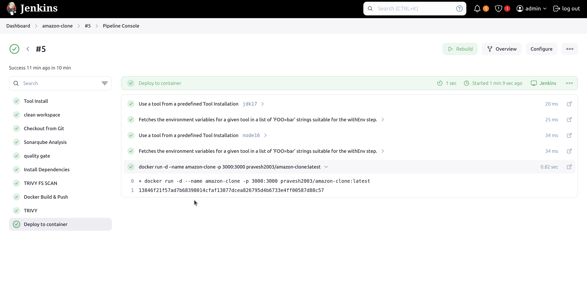
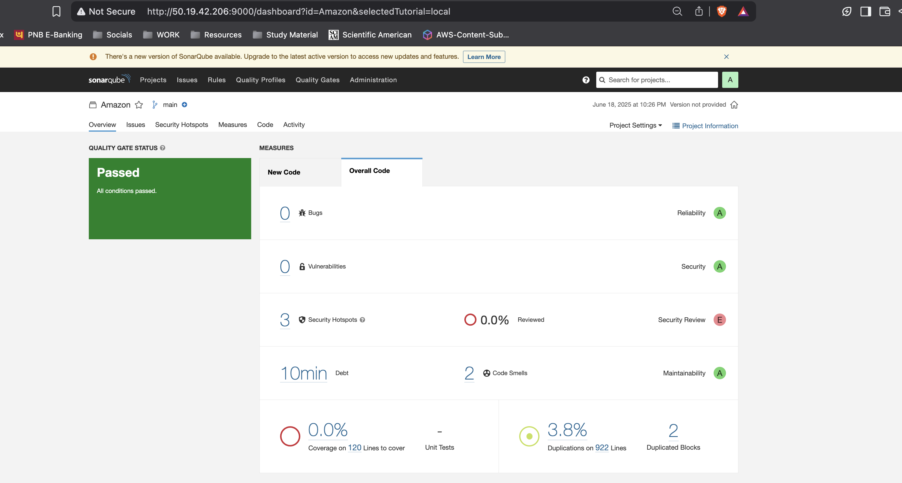

# 🛒 Amazon Clone Deployment on AWS with Jenkins & Terraform

This project demonstrates how to deploy a **Node.js-based Amazon Clone** to an **AWS EC2 instance** using **Docker, Terraform, and Jenkins**, while integrating **DevSecOps practices** using tools like **SonarQube**, **Trivy**, and **OWASP Dependency Check**.

---

## 🔧 Tech Stack & Tools Used

- **Node.js** – Web application
- **Docker** – Containerization
- **AWS EC2** – Cloud compute instance
- **Terraform** – Infrastructure as Code (IaC)
- **Jenkins** – CI/CD pipeline automation
- **SonarQube** – Static code analysis
- **Trivy** – Container and filesystem vulnerability scanning
- **OWASP Dependency Check** – Open source dependency vulnerability scanner

---

## 🚀 What You'll Learn

- Building and testing a Node.js app locally with Docker
- Provisioning infrastructure on AWS using Terraform
- Setting up Jenkins with essential tools and plugins
- Implementing CI/CD pipeline for build, test, scan, and deployment
- Integrating SonarQube, Trivy, and OWASP for DevSecOps

---

## 📦 Project Structure

```

amazon-clone/
├── app/                       # Node.js application source
├── Config/                   # Terraform files and user-data script
│   ├── main.tf
│   ├── install\_tools.sh
│   └── variables.tf
├── Jenkinsfile               # Jenkins pipeline configuration
├── Dockerfile
└── README.md

````

---

## 🧰 Prerequisites

- AWS Account with IAM user having EC2 full access
- Docker installed and running locally
- AWS CLI configured (`aws configure`)
- Jenkins installed or running on the EC2 instance
- Terraform installed (`>= 1.0`)

---

## 🧪 Local Testing (Optional)

```bash
git clone https://github.com/Pravesh-Sudha/amazon-clone.git
cd amazon-clone
docker build -t amazon-clone .
docker run -p 3000:3000 --name amazon-clone amazon-clone:latest
````

Open your browser at `http://localhost:3000`.

---

## ☁️ Deploy to AWS using Terraform

```bash
cd amazon-clone/Config
terraform init
terraform apply --auto-approve
```

Ensure you:

* Replace the **AMI ID** and **key name** in `main.tf`
* Add your `install_tools.sh` to automate Jenkins, Docker, SonarQube installs

---

## 🔧 Jenkins Pipeline Configuration

Create a Jenkins Pipeline project and paste the contents from `Jenkinsfile`.

The pipeline performs the following stages:

1. Clean workspace
2. Checkout code from GitHub
3. SonarQube analysis
4. OWASP dependency scan
5. Trivy FS and Image scans
6. Docker build & push
7. Application deployment to EC2

> 🔐 Credentials:
>
> * Add SonarQube token as **Secret Text** in Jenkins credentials
> * Add DockerHub username/password as **Username & Password** credentials

---

## 🧹 Clean Up Resources

To avoid unwanted AWS billing:

```bash
cd amazon-clone/Config
terraform destroy --auto-approve
```

---

## 📸 Screenshots

* Jenkins Pipeline
* SonarQube Dashboard
* Application running on EC2





---

## 📬 Connect with Me

If you enjoyed this project or have any questions, feel free to reach out!

* 🔗 [Blog](https://blog.praveshsudha.com)
* 🐦 [Twitter](https://x.com/praveshstwt)
* 💼 [LinkedIn](https://www.linkedin.com/in/pravesh-sudha/)
* 📹 [YouTube](https://youtube.com/@pravesh-sudha)
* 🧑‍💻 [GitHub](https://github.com/Pravesh-Sudha)

---

## 📄 License

This project is open-source under the [MIT License](LICENSE).

